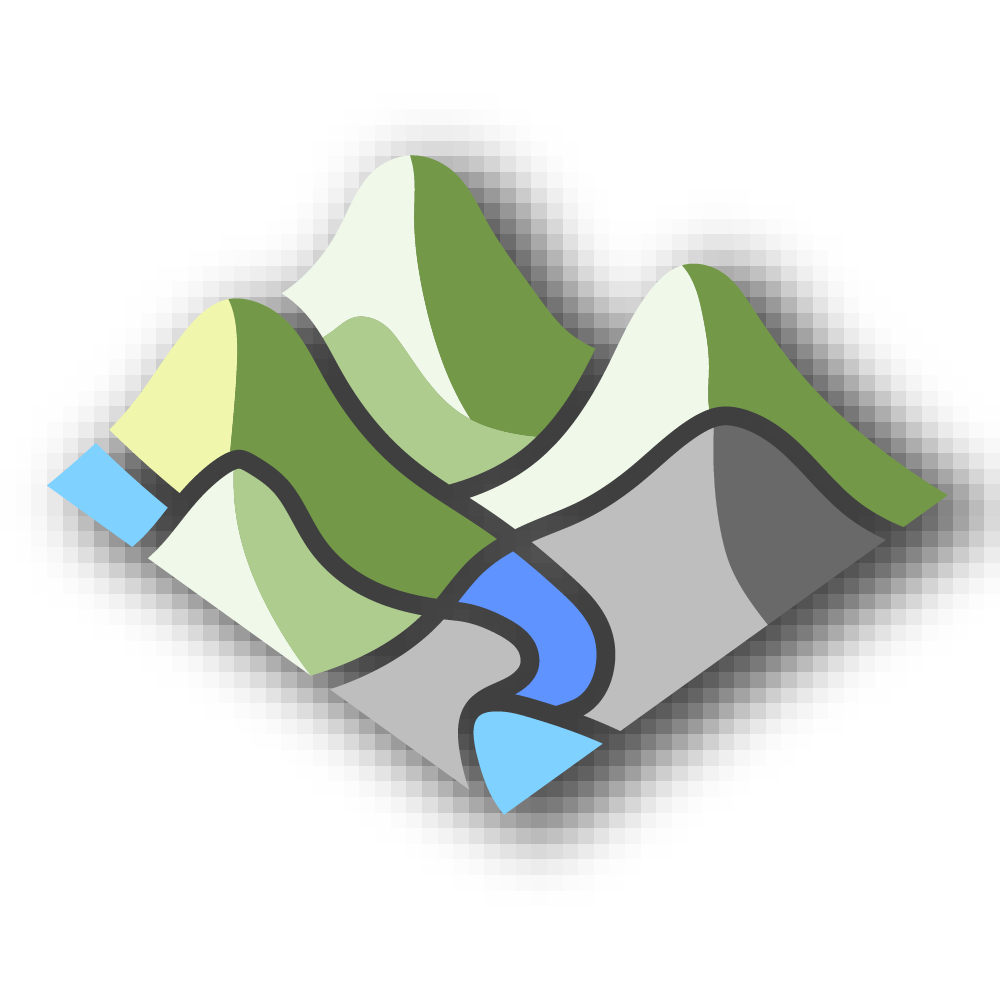

<div align="center">



# BeingAliveTerrain

[](https://www.rhino3d.com/8/)
[](https://www.grasshopper3d.com/)
[](LICENSE.txt)

</div>

## Introduction

The `BeingAliveTerrain` plugin for `Grasshopper` implements a set of powerful terrain editing and analysis tools for landscape architects, civil engineers, and environmental designers. Developed at the [Chair of Being Alive](https://www.gali-izard.arch.ethz.ch/) at ETH Zurich, this plugin provides intuitive methods for terrain manipulation and cut-and-fill volume analysis.

This software allows users to quickly edit terrain meshes using points, curves, or closed areas with smooth transitions and customizable influence zones. It also provides comprehensive cut-and-fill analysis with multiple visualization color maps for informed decision-making in earthwork projects.

The tool serves both landscape design and civil engineering fields, supporting various design and analysis workflows when working with terrain data.

## Features

### Terrain Editing Tools

- **Point-Based Terrain Editing** (`TerrainPointEdit`): Pull or push terrain mesh vertices using one or multiple control points with smooth falloff.
- **Curve-Based Terrain Editing** (`TerrainCurveEdit`): Edit terrain along curves with customizable influence distance and strength.
- **Area-Based Terrain Editing** (`TerrainAreaEdit`): Modify terrain within closed boundary curves with options for flat or sloped surfaces.

### Analysis Tools

- **Cut and Fill Analysis** (`CutFill`): Calculate earthwork volumes between existing and proposed terrain meshes with:
  - Detailed volume calculations (cut, fill, and net volumes)
  - Visual analysis meshes with customizable color maps
  - Separate extraction of cut and fill mesh regions
  - Support for multiple boundary areas
  - Six built-in color maps: Parula, Jet, Plasma, Viridis, RedWhiteBlue, and RedWhiteGreen

### Key Capabilities

- **Smooth Interpolation**: Multiple smoothing functions (SmoothStep, SmootherStep, Cosine) for natural-looking terrain transitions
- **Multi-Element Support**: All tools support multiple control elements (points, curves, areas) simultaneously
- **Customizable Color Maps**: Six professional color schemes for analysis visualization
- **Real-Time Feedback**: Interactive editing with immediate visual feedback
- **Volume Calculations**: Precise earthwork volume computations for project planning

## Usage

### Terrain Editing

1. **Point Edit**: Select a mesh and add control points with desired heights. Adjust strength (-100 to +100) and blur distance to control the editing influence.

2. **Curve Edit**: Use curves at desired elevations to reshape terrain. The mesh will interpolate smoothly between the curve and surrounding terrain.

3. **Area Edit**: Define closed boundaries to create plateaus, depressions, or graded surfaces. Use the "Flat" option to create level areas or leave it off for sloped transitions.

### Cut and Fill Analysis

1. Input boundary curves defining analysis areas
2. Provide existing and proposed terrain meshes
3. Set grid size for analysis resolution (smaller = more accurate, slower)
4. Right-click the component to select preferred color map
5. Extract volume data and visualization meshes for documentation

## Install

### Via Rhino Package Manager

For Rhino 8+, users can use the embedded `PackageManager` to install the plugin (when available):

1. Type `PackageManager` in the Rhino command window
2. Search for `BeingAliveTerrain` and install

### Manual Installation

1. Download the latest `.gha` file from the [Releases](https://github.com/ChairBeingAlive/BeingAliveTerrain/releases) page
2. Copy the file to your Grasshopper Libraries folder:
   - Windows: `%AppData%\Grasshopper\Libraries`
   - Mac: `~/Library/Application Support/McNeel/Rhinoceros/Scripts`
3. Unblock the file (Windows: Right-click → Properties → Unblock)
4. Restart Rhino/Grasshopper

## System Requirements

- Rhino 8.15 or higher
- Grasshopper 1.0 or higher
- .NET 8.0 Runtime
- Windows or macOS

## Credit & Citation

Author: [Dr. Zhao Ma](https://beyond-disciplines.com/)

If `BeingAliveTerrain` contributes to an academic publication, please cite it as:

```bibtex
@software{beingaliveterrain,
  title = {BeingAliveTerrain},
  author = {Zhao Ma},
  url = {https://github.com/ChairBeingAlive/BeingAliveTerrain},
  version = {0.1.3},
  year = {2024}
}
```

## Author

The tool is created by [Dr. Zhao MA](https://beyond-disciplines.com/) at the research group [Chair of Being Alive](https://www.gali-izard.arch.ethz.ch/), ETH Zurich.

The author would like to thank the following colleagues for their generous contribution: Prof. Teresa Gali-Izard, Luke Harris, Bonnie-Kate Walker, Cara Turett, Uxia Varela.

## License

BeingAliveTerrain is released under an [MIT License](LICENSE.txt).

BeingAliveTerrain is created and maintained by academics: Please cite `BeingAliveTerrain` or otherwise give a shout-out if and when it contributes to published works.


## Technical Details

- **Target Framework**: .NET 8.0 (Windows and cross-platform)
- **Dependencies**: Grasshopper SDK, System.Drawing.Common
- **Color Maps**: 6 built-in perceptually-uniform and diverging color schemes
- **Interpolation**: SmootherStep (Ken Perlin's improved smoothstep) for natural terrain transitions

## Support

For bug reports, feature requests, or questions:
- Open an issue on [GitHub Issues](https://github.com/ChairBeingAlive/BeingAliveTerrain/issues)

## Related Projects

- [BeingAliveLanguage](https://github.com/ChairBeingAlive/BeingAliveLanguageGH) - Soil visualization and analysis tools for Grasshopper

---

**Chair of Being Alive** | ETH Zurich | [www.gali-izard.arch.ethz.ch](https://www.gali-izard.arch.ethz.ch/)